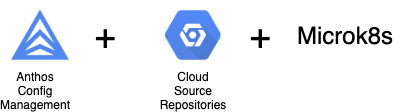
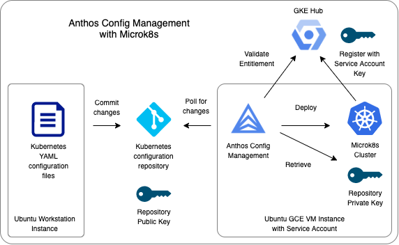
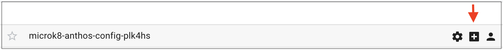
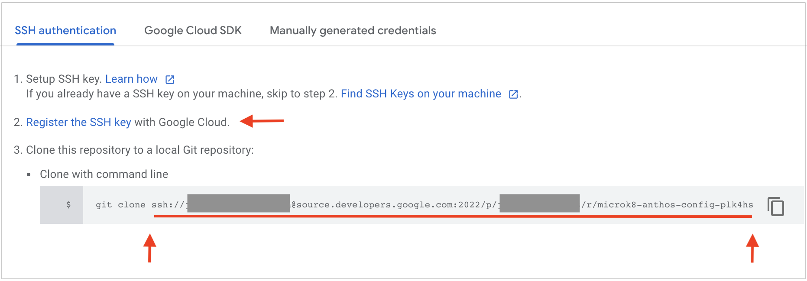
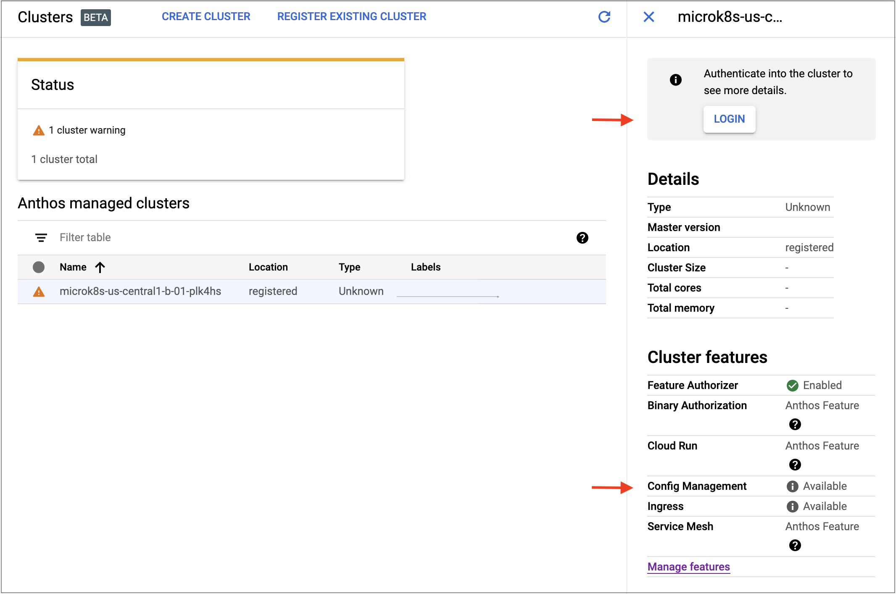
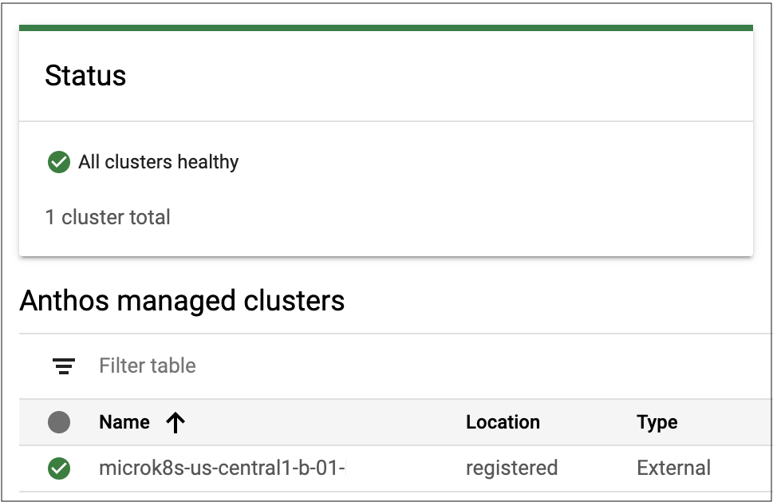

# Deploying to Microk8s with Anthos Config Management

[Anthos Config Management](https://cloud.google.com/anthos/config-management)  enables you to automate policy and security at scale for your hybrid and multi-cloud Kubernetes deployments.  At a high level, you commit your Kubernetes code to a central Git repository and Anthos Config Management deploys the code to all of the registered clusters.  In short, Anthos Config Management allows you to bring GitOps practices to multi-cloud container management.

Anthos Config Management is supported on GKE-based clusters and on [Anthos attached clusters](https://cloud.google.com/anthos/docs/setup/attached-clusters), a deployment option that extends Anthos’ reach into Kubernetes clusters running in other environments including Amazon EKS and Azure AKS.
In this overview, you will learn how to set up an Anthos attached cluster using
[Microk8s](https://microk8s.io/), a Kubernetes platform that is sometimes used
in IoT environments.  While *Microk8s itself is not an officially [supported configuration](https://cloud.google.com/anthos/docs/version-and-upgrade-support)*, we will use Microk8s in an *experimental* capacity so you can learn more about Anthos Config Management and consider Anthos Config Management for your projects.

We will use the following Google Cloud services:

* Compute Engine will be used for our Microk8s cluster. We will just use a single node running Ubuntu. Ubuntu will use cloud-init to install Microk8s and generate shell scripts and other files to save time.

* Cloud Source Repositories will provide the Git-based repository to which we will commit our workload.

* Anthos Config Management will perform the deployment from the repository to the Microk8s cluster.

You will use Terraform and shell scripts to build the lab infrastructure. I will point out important parts of the scripts. Feel free to read the scripts if you wish. You will type some commands directly, but my goal is to provide a working example you can refer to in the future. Sound good? I hope so! Let's get building.

# Disclaimers

* This article and the associated repository are not officially supported Google products.

* Microk8s is not an officially supported configuration for Anthos attached
  clusters.

# Assumptions and prerequisites

Here are my assumptions and prerequisites going forward:

* You have the ability to login to the Google Cloud console with an identity that has the Owner and Service Account User roles.

* You have a Google Cloud project that you can use for labs that will not interfere with any projection work. If you do not have such a project, please see this link to learn how to create one.

* You are familiar with core Google Cloud concepts such as projects.

* You are comfortable with the use of the cloud console and the Cloud Shell.

* You understand Git-related concepts such as cloning and committing code.

# Let's start with a picture

I'd like to start off with a picture of what we are going to build.



Here's how all of this fits together.

* We will start by launching a workstation instance and then deploying four things: (a) an IAM service account, (b) a Google Compute Engine Instance with Microk8s using permissions provided by the service account, (c) a Kubernetes configuration repo provided by Cloud Source Repositories, and (4) a public/private key pair.

* The GCE instance will use the service account key to register the Microk8s cluster with the GKE Hub. Even though we will be using Microk8s rather than GKE for this walkthrough, the GKE Hub serves as a registration point for making clusters available to Anthos.

* The public key from the public/private key pair will be registered to the repository while the private key will be registered with the Microk8s cluster.

* Anthos Config Management will be configured to point to the repository and branch to poll for updates.
When a Kubernetes YAML document is pushed to the appropriate branch of the repository, Anthos Config Management will use the private key to connect to the repository, detect that a commit has been made against the branch, fetch the files and apply the document to the Microk8s cluster.

Now that we know what we are going to build, let's get to work!

# Create a workstation instance

You will need a workstation in which to execute commands. The scripts used are based on Ubuntu. So let's create an Ubuntu instance.

* Sign into the Google Cloud console and switch the project in which you wish to deploy this infrastructure. 

* Create a service account with the Owner and Service Account User roles.

* Launch a Compute Engine Ubuntu 20.04 LTS instance with an e2-small instance type using the service account you just created. Make note of the instance name you use.

# Clone the workshop repository

* Ssh into the workstation instance you just created.

* Clone the workshop repository using the command below.

```
git clone https://github.com/google/anthos-microk8s.git
```

* Change your working directory to that of the cloned workshop repository. Set the BASEDIR environment variable to that directory so you can go to it more easily.

```
cd gcp-anthos-microk8s
export BASEDIR=`pwd`
```

# Explore the repository

Let's examine the structure of the repository. Here's a diagram of the directory structure.

```
gcp-anthos-microk8s/
├── CONTRIBUTING.md
├── LICENSE
├── README.md
├── anthos-cm
│   └── static
│       ├── hello.yaml
│       └── microk8s.yaml
├── cleanup
│   └── 910-disable-anthos
├── img
│   ├── AnthosCMHighLevel.png
│   ├── AnthosMicrok8sTitle.png
│   ├── ClusterPostLogin.png
│   ├── PostClone.png
│   ├── PreRegister.png
│   └── SourceRepoPreClone.png
├── main.tf
├── modules
│   ├── microk8s
│   │   ├── main.tf
│   │   ├── outputs.tf
│   │   └── variables.tf
│   └── serviceaccount
│       ├── main.tf
│       ├── outputs.tf
│       └── variables.tf
├── outputs.tf
├── setup
│   ├── 110-enable-apis
│   ├── 120-install-terraform
│   └── 130-install-nomos
├── terraform.tfvars
└── variables.tf
```

* The setup directory contains shell scripts to set up the workstation instance.

* There are three Terraform modules which can be identified by the presence of the *main.tf*, *variables.tf*, and *outputs.tf files*. The root module sits at the top of the tree and drives the overall deployment. The *microk8s* module creates the Ubuntu instance and installs microk8s. The *serviceaccount* module sets up the IAM service account that is used by the Ubuntu instance.

# Prepare the workstation

* Enable the appropriate APIs for your project using the command below. You will be asked to confirm the charges associated with the Anthos API.

```
cd $BASEDIR/setup
./110-enable-apis
```

* Install *Terraform* for deploying the infrastructure.

```
./120-install-terraform
```

* Install *Nomos* which you will use to set up the Kubernetes configuration cluster and go back to the base directory.

```
./130-install-nomos
cd $BASEDIR
```

# Deploy the infrastructure

* Enter the commands below to deploy the infrastructure with Terraform. The *terraform* init command downloads all external modules and validates the structure of the Terraform files. The *terraform plan* command creates a deployment plan. Substitute your Google Cloud project ID for *MY_PROJECT_ID*. The *terraform apply* command applies the deployment plan to create the infrastructure.

```
terraform init
terraform plan --out=plan.out -var="project=MY_PROJECT_ID"
terraform apply plan.out
````

* After you enter the terraform apply command, the Terraform code waits until the infrastructure fully deploys which can take up to five minutes. Terraform will create the service account and then launch an instance and deploy Microk8s on the instance.  At the end of the build you should see output similar the figure below.

```
Outputs:

Output10_resource_suffix = plk4hs
Output20_repository_name = microk8-anthos-config-plk4hs
Output30_service_account_email = anthos-register-plk4hs@jslevine-anthos.iam.gserviceaccount.com
Output40_instance_names = [
  "microk8s-us-central1-b-01-plk4hs",
]
```

* The *resource_suffix* above is a random suffix which is appended to the names of the deployed Google Cloud resources as shown in the lines that follow. This enables you to deploy the code multiple times in the same Google Cloud project. It will also help you identify resources in the event that there is a problem with the cleanup scripts.

* Open a scratch file on your system and copy the outputs from Terraform into the scratch file to make them easier to access later.

# Configure the repository

* The Terraform scripts created additional files on your workstation. The anthos-cm directory now has additional files that we will use to to prepare the repository for Anthos Config Management. The anthos-cm directory structure appears below.

```
anthos-cm
├── static
│   ├── hello.yaml
│   └── microk8s.yaml
└── var
    ├── 200-setup-repo
    └── acm-public-key.openssh
```

* In the above diagram, the *static* directory contains YAML files that represent the application you will eventually commit to the Kubernetes configuration repository provided by Cloud Source Repositories which will in turn be deployed to the Microk8s cluster. The *var* directory contains files that will be used to configure the repository.
In order for Anthos Config Management to check the repository for commits, you must install a public key in Cloud Source Repositories. A public key has been created for you. Display the key using the command below.

```
cat $BASEDIR/anthos-cm/var/acm-public-key.openssh
```

* From the Google Cloud console, select Source Repositories. Hover over the line and click the "+" icon as shown below. You will then see a window appear with additional information.





* Click the Register the SSH key link. You may be asked to enter your account password. A new window will open. Pick a name for the key and then paste in the contents of the *acm-public-key.openssh* file you previously displayed and click *REGISTER*.

* Go back to the window with the cloning information. In the field under *Clone with command line*, copy the URL beginning with ssh:// until the end of the line into your scratch file.

* Use the following commands to initialize the repository.

```
cd $BASEDIR/anthos-cm/var
./200-setup-repo
```

* At the end of the setup process, notice that the branch microk8s has been created. The branch name will need to be specified when Anthos Config management is created.

```
Branch 'microk8s' set up to track remote branch 'microk8s' from 'origin'.
```

* You have completed the core configuration of the repository. You will now set up Anthos Config Management on the Microk8s cluster instance.

# Set up Anthos Config Management

You will now set up Anthos Config Management on the Microk8s cluster instance.

* Ssh into the Microk8s cluster instance. The instance name contains the random suffix shown in the outputs of the Terraform run.

* Go to the directory containing the installation scripts.

```
cd /usr/local/etc/anthos
```

* Register the Microk8s cluster with the Anthos/GKE Hub using the command on the below. The output is shown after that. This script makes the cluster available for use by Anthos. At the completion of the script, you will see a message indicating the cluster has been registered.

```
./110-register-cluster

Registering cluster to hub...
Waiting for membership to be created...done.                                                                      
Created a new membership [projects/jslevine-anthos/locations/global/memberships/microk8s-us-central1-b-01-plk4hs] for the cluster [microk8s-us-central1-b-01-plk4hs]
Generating the Connect Agent manifest...
Deploying the Connect Agent on cluster [microk8s-us-central1-b-01-plk4hs] in namespace [gke-connect]...
Deployed the Connect Agent on cluster [microk8s-us-central1-b-01-plk4hs] in namespace [gke-connect].
Finished registering the cluster [microk8s-us-central1-b-01-plk4hs] with the Hub.
```

* In order to allow the Google Cloud console to view information about the cluster, you will first create a Kubernetes Service Account with the command below.

```
./120-create-ksa

Creating Kubernetes service account anthos-ksa...
serviceaccount/anthos-ksa created
Creating console-reader-role cluster role...
clusterrole.rbac.authorization.k8s.io/cloud-console-reader created
Binding console-reader-role cluster role to cluster anthos-ksa...
clusterrolebinding.rbac.authorization.k8s.io/cloud-console-reader-binding created
Binding view cluster role to cluster anthos-ksa...
clusterrolebinding.rbac.authorization.k8s.io/view-binding created
```

* Now that you have created a Kubernetes Service Account, you will get a token for the service account to register with the Google Cloud console.


```
./130-get-ksa-bearer-token
=== The cluster token starts below this line. ===
ey....
=== The cluster token ends above this line. ===
```

* Copy the entire token between the start/end lines to your clipboard. You may find it easier to select from the end of the token back to the beginning. You must get all of the characters.

* Go to the Google Cloud console and select the Anthos -> Clusters menu. You will see the Microk8s cluster and may see a warning indicator as well. Click on the cluster and you will see a LOGIN button on the right side of the screen as shown below. Also note that Config Management is available, but not enabled.



* Click *LOGIN*. Select the Token radio button and paste in the bearer token from your clipboard and click *LOGIN*. You should see a message saying the cluster is healthy as shown below. If it is not successful, copy and paste the bearer token again into your clipboard to ensure you have all of the characters.



* Click on the cluster. On the right side of the window, you will see a *Cluster features* section. If *Config Management* is not enabled, click on the *Manage features* and enable it.

* On the Microk8s cluster instance, you will see the file */usr/local/etc/acm-private-key.pem*. This is the private key associated with the *acm-public-key.openssh* that you configured into Cloud Source Repositories. Anthos Config Management needs this private key in order to be able to poll the Kubernetes repo for commits. Register the key using the command below. This will store the secret into the Microk8s cluster.

```
./210-register-acm-private-key
```

* You now need to configure Anthos Config Management and tell it the name of the repo and the branch to use. Edit the file */usr/local/etc/anthos/config-management.yaml*. Replace *INSERT_SSH_CLONE_HERE* with the ssh:// URL that you copied into your scratchfile from the Cloud Source Repositories page. Do not include "git clone." Also, make sure you retain the quotation marks ("). Save the file.

* Deploy the configuration to Anthos Config Management with the command below.

```
./220-config-acm
```
* Check the status by running the command below.

```
./230-check-acm-status
```

The Status value will vary between *ERROR* and *NOT_CONFIGURED* until eventually becoming *PENDING*, and finally *SYNCED*. The process can take a few minutes to complete.

* You have now configured Anthos Config Management. In the next section, you will deploy a Kubernetes application.

# Deploy the application

You will now create a Kubernetes namespace and deploy an application by committing files to the repository from your workstation instance and viewing the results on the Microk8s cluster instance.

* Let's start by creating a namespace named microk8s. On your workstation instance, change your working directory to the cloned repository directory by entering the command below.

```
cd $BASEDIR/anthos-cm/var/micro*
```

* The *namespaces* directory contains one directory for each namespace you wish to deploy. Create the namespaces/microk8s directory.

```
mkdir namespaces/microk8s
```

* Copy the namespace configuration into the newly created directory.

```
cp $BASEDIR/anthos-cm/static/microk8s.yaml namespaces/microk8s
cat namespaces/microk8s/microk8s.yaml
```

* Notice how the name of the directory under the *namespaces* directory, the name of the YAML file defining the namespace, and the metadata field are identical. This is a requirement.

* Now commit the change to the repository. Note that you are committing to the *microk8s* branch. This is the branch name defined in the *config-management.yaml* file that was used to configure Anthos Config Management above.

```
git add namespaces/microk8s/microk8s.yaml
git commit -m "define namespace microk8s"
git push -u origin microk8s
```

* Go to your Microk8s cluster instance and run kubectl to check for the presence of the namespace. It may take a minute or two for it to be available.

```
kubectl get namespaces

NAME                       STATUS   AGE
config-management-system   Active   139m
default                    Active   23h
gke-connect                Active   8h
kube-node-lease            Active   23h
kube-public                Active   23h
kube-system                Active   23h
microk8s                   Active   96s
```

* You can see that a namespace was deployed. Run the following command to learn more about the namespace.

```
kubectl describe namespace microk8s
```

* In the output for the above command you can see labels and annotations that refer to *configmanagement.gke.io* which shows that the namespace was deployed with  Anthos Config Management.

* On your workstation instance, run the commands below to deploy the *hello* application.

```
cd $BASEDIR/anthos-cm/var/micro*
cp $BASEDIR/anthos-cm/static/hello.yaml namespaces/microk8s
git add namespaces/microk8s/hello.yaml
git commit -m "deploying hello.yaml"
git push -u origin microk8s
```

* On the Microk8s cluster instance, run the two *kubectl* commands below to view the deployments. Some output columns have been removed to improve the readability of the information.

```
kubectl get deployments -n microk8s

NAME        READY   UP-TO-DATE   AVAILABLE   AGE
hello-app   1/1     1            1           13m

kubectl get services -n microk8s

NAME             TYPE       CLUSTER-IP      ... PORT(S) ...
hello-nodeport   NodePort   10.152.183.24   ... 80:31423/TCP ...
```

* The output shows that there have been two deployments, an application named *hello-app* and a service named *hello-nodeport*. Note the *CLUSTER-IP* address for the *hello-nodeport* service.
Use the *curl* command to communicate with the service and the backend application.

```
curl 10.152.183.24

Hello, world!
Version: 1.0.0
Hostname: hello-app-578d477bbd-gqxj6
```

* You have now completed the deployment of the application and nodeport service. Rather than logging on to each instance running a cluster and using *kubectl* to manually deploy the code, Anthos Config Management allowed you to automate the process. You commited the code to a Git repository and Anthos Config Management detected the commit and deployed the code for you.

Cleanup

Here are the steps to follow on both the MicroK8s cluster instance and on the workstation instance.

* On the Microk8s cluster instance, unregister the cluster using the command below.

```
cd /usr/local/etc/anthos
./910-unregister-cluster
```

* On the workstation instance, disable the Anthos API if you are no longer using so as not to incur Anthos API-related changes. *Note that this does not disable any of the other APIs that were previously enabled.*


```
cd $BASEDIR/cleanup
./910-disable-anthos
```

* Tear down the infrastructure provisioned by Terraform. Replace MY_PROJECT_ID in the command below with your Google Cloud project ID.

```
cd $BASEDIR
terraform destroy -var="project=MY_PROJECT_ID"
```

* Delete the workstation instance if you no longer need it.

# Other items of interest

* You can specify the number of Microk8s instances and the regions in which they
  are deployed by modifying the *intanceInfo* variable in the *terraform.tfvars* file in the root Terraform
  module.

* The Terraform code in *modules/microk8s/main.tf* uses
  *[cloud-init](https://cloudinit.readthedocs.io/en/latest/index.html)* to
  initialize the Ubuntu instance.  Cloud-init provides a structure way to
  perform various tasks such as writing files and running scripts at various
  stages of the boot process.  In the deployed infarstructure, cloud-init
  installs Microk8s and also sets up the */usr/local/etc/anthos* file structure.

  When using cloud-init in an instance being built by a framework such as
  Terraform or even shell scripts, it may be desirable to know when cloud-init's
  processing has completed. There are two parts to doing this.  First, the
  cloud-init script adds a label to the instance after cloud-init's
  initialization has completed.  Second, a *[null
  resource](https://registry.terraform.io/providers/hashicorp/null/latest/docs/resources/resource)*
  waits until a label has been created.

# Let's review

Anthos Config Management enables you to deploy code from a Git repository to Kubernetes clusters that have been registered with Anthos. Google Cloud currently supports GKE, AKS, and EKS clusters, but you can attach other conformant clusters as well.
This example shows how to register a single Microk8s cluster to receive deployments from a repository provided by Cloud Source Repositories. You can scale this to larger numbers of clusters all of which can receive updates from commitments to the repository. In short, Anthos Config Management allows you to bring Git-ops practices to the world of Kubernetes deployments.
